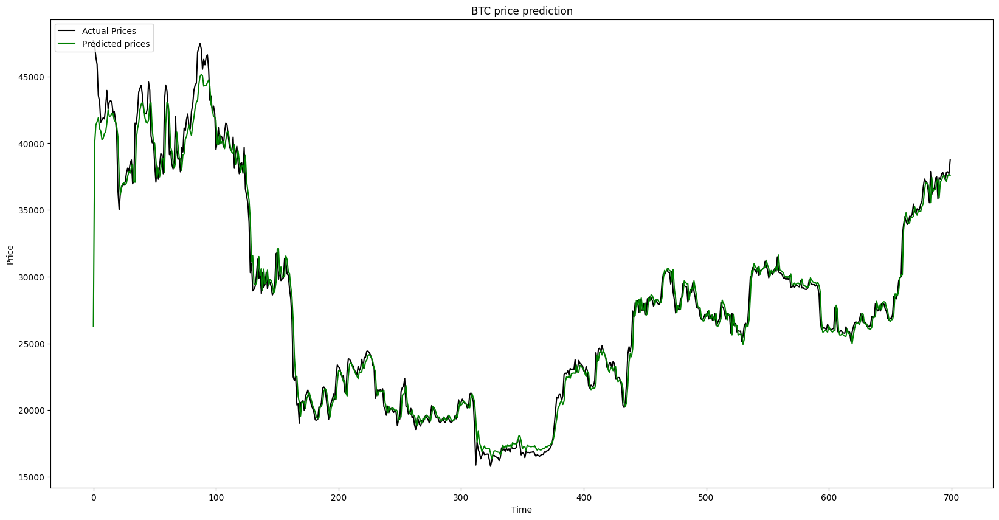

# Bitcoin Price Prediction using LSTM

## Introduction

This project involves predicting Bitcoin prices using LSTM neural networks, leveraging historical price data. The LSTM model is trained to forecast future Bitcoin prices based on patterns and trends observed in past data.

## Table of Contents

- [Introduction](#introduction)
- [Installation](#installation)
- [Data](#data)
- [Model Training](#model-training)
- [Evaluation](#evaluation)
- [Final Prediction](#final-prediction)

## Installation
1. Clone this repository:
   ```bash
   git clone https://github.com/DaniilKarunou/BTCPredictor.git
   ```
2. Install the required dependencies using `pip install -r requirements.txt`.
    ```bash
    pip install -r requirements.txt
    ```

## Data

The dataset used in this project is historical Bitcoin price data obtained from yahoo finance.
It consists of daily Bitcoin price information starting from 2012 to 2023.

## Model Training

The LSTM models is constructed using TensorFlow/Keras. 
Training involves fitting the model to historical Bitcoin 
price data, where the LSTM learns patterns and trends to make predictions.

## Evaluation

The model's performance can be evaluated using various metrics 
such as mean squared error (MSE), mean absolute error (MAE), and mean 
absolute percentage error (MAPE) on both training and validation sets.

## Final Prediction



This image displays the final prediction made by the model based on historical Bitcoin prices.
